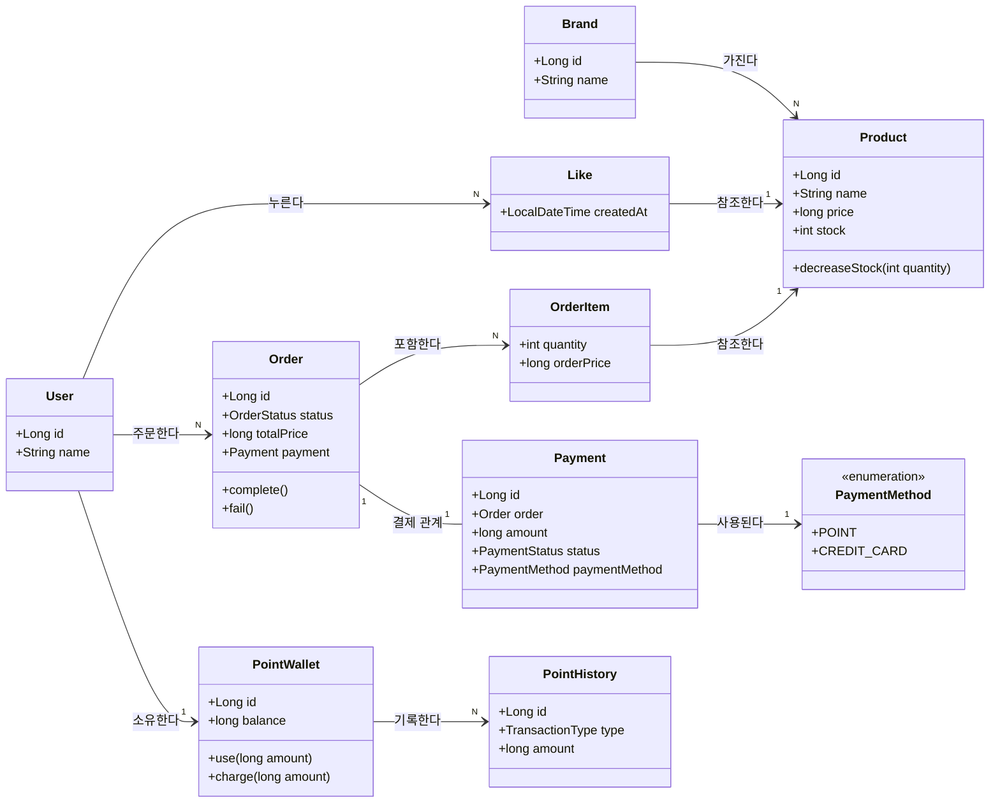

# 클래스 다이어그램

```mermaid
classDiagram
    direction LR

    class User {
        +Long id
        +String name
    }

    class Product {
        +Long id
        +String name
        +long price
        +int stock
        +decreaseStock(int quantity)
    }

    class Brand {
        +Long id
        +String name
    }

    class Order {
        +Long id
        +OrderStatus status
        +long totalPrice
        +Payment payment
        +complete()
        +fail()
    }

    class OrderItem {
        +int quantity
        +long orderPrice
    }

    class Like {
        +LocalDateTime createdAt
    }

    class PaymentMethod {
        <<enumeration>>
        +POINT
        +CREDIT_CARD
    }

    class Payment {
        +Long id
        +Order order
        +long amount
        +PaymentStatus status
        +PaymentMethod paymentMethod
    }

    class PointWallet {
        +Long id
        +long balance
        +use(long amount)
        +charge(long amount)
    }

    class PointHistory {
        +Long id
        +TransactionType type
        +long amount
    }

    User --> "N" Order : 주문한다
    User --> "N" Like : 누른다
    User --> "1" PointWallet : 소유한다

    Brand --> "N" Product : 가진다

    Like --> "1" Product : 참조한다
    OrderItem --> "1" Product : 참조한다

    Order --> "N" OrderItem : 포함한다
    Order "1" -- "1" Payment : 결제 관계

    Payment --> "1" PaymentMethod : 사용된다

    PointWallet --> "N" PointHistory : 기록한다
```
