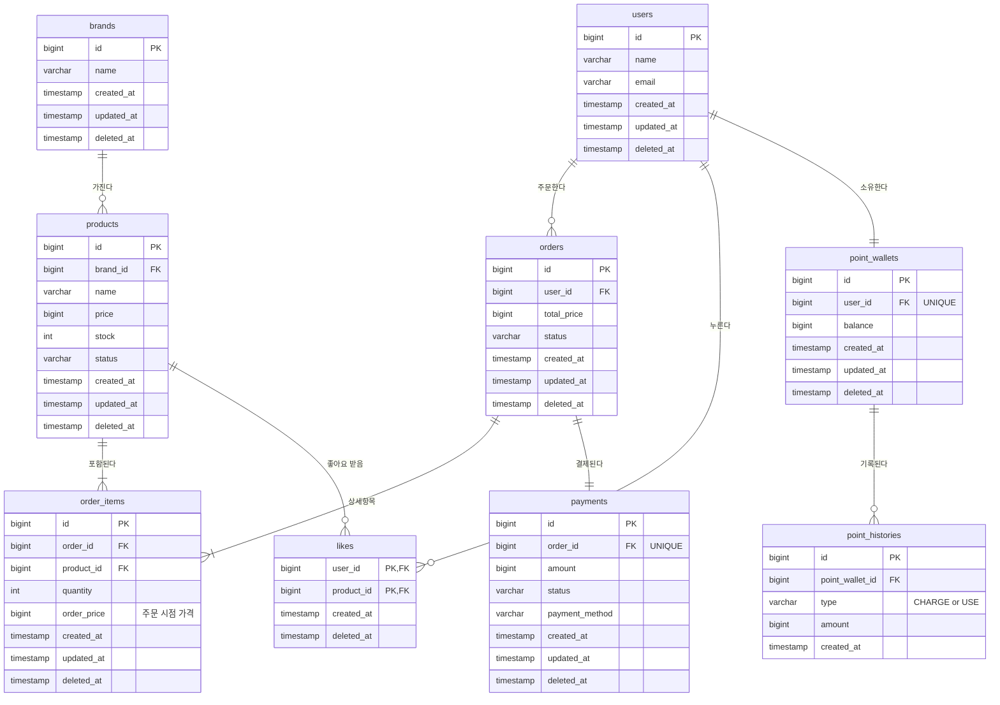

# ERD

```mermaid
erDiagram
    users {
        bigint id PK
        varchar name
        varchar email
        timestamp created_at
        timestamp updated_at
        timestamp deleted_at
    }

    point_wallets {
        bigint id PK
        bigint user_id FK "UNIQUE"
        bigint balance
        timestamp created_at
        timestamp updated_at
        timestamp deleted_at
    }

    point_histories {
        bigint id PK
        bigint point_wallet_id FK
        varchar type "CHARGE or USE"
        bigint amount
        timestamp created_at
    }

    products {
        bigint id PK
        bigint brand_id FK
        varchar name
        bigint price
        int stock
        varchar status
        timestamp created_at
        timestamp updated_at
        timestamp deleted_at
    }

    brands {
        bigint id PK
        varchar name
        timestamp created_at
        timestamp updated_at
        timestamp deleted_at
    }

    orders {
        bigint id PK
        bigint user_id FK
        bigint total_price
        varchar status
        timestamp created_at
        timestamp updated_at
        timestamp deleted_at
    }

    order_items {
        bigint id PK
        bigint order_id FK
        bigint product_id FK
        int quantity
        bigint order_price "주문 시점 가격"
        timestamp created_at
        timestamp updated_at
        timestamp deleted_at
    }

    payments {
        bigint id PK
        bigint order_id FK "UNIQUE"
        bigint amount
        varchar status
        varchar payment_method
        timestamp created_at
        timestamp updated_at
        timestamp deleted_at
    }

    likes {
        bigint user_id PK, FK
        bigint product_id PK, FK
        timestamp created_at
        timestamp deleted_at
    }

    users ||--o{ orders : "주문한다"
    users ||--o{ likes : "누른다"
    users ||--|| point_wallets : "소유한다"

    brands ||--o{ products : "가진다"
    products ||--|{ order_items : "포함된다"
    products ||--o{ likes : "좋아요 받음"

    orders ||--|{ order_items : "상세항목"
    orders ||--|| payments : "결제된다"

    point_wallets ||--o{ point_histories : "기록된다"
```
